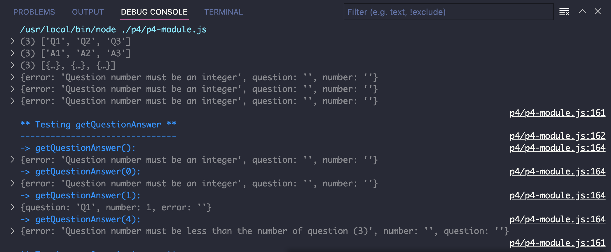
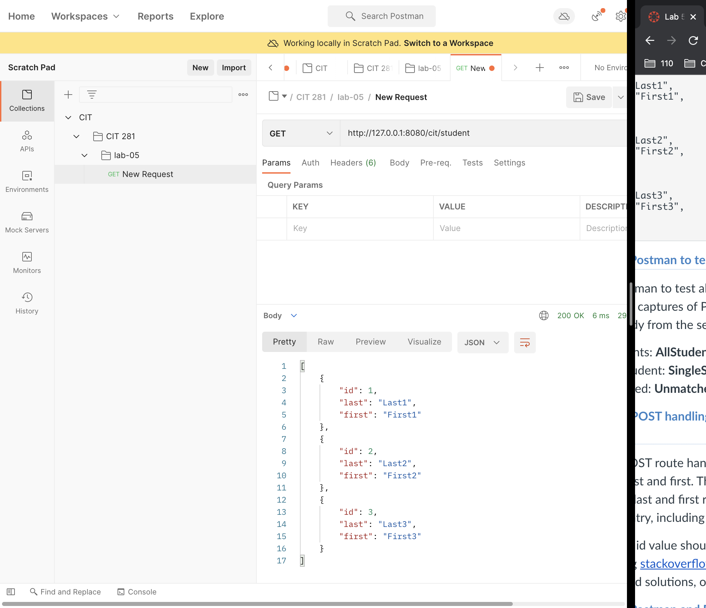

Project-4 

This function is kind of similar to project 3. I also need to interpreting functional descriptions and specifications to complete the whole project by creating a basic module. 

The new thing we learned for this project is to get to know how to use Fastify and how to develop the different routes. We learned how to import and export files and create the correct code for the right route to display it on chrome or web page. 

We also get to experience the postman. It is such a convenient way to test the route. Here is a really simple example of Postman processing and testing a sever.

